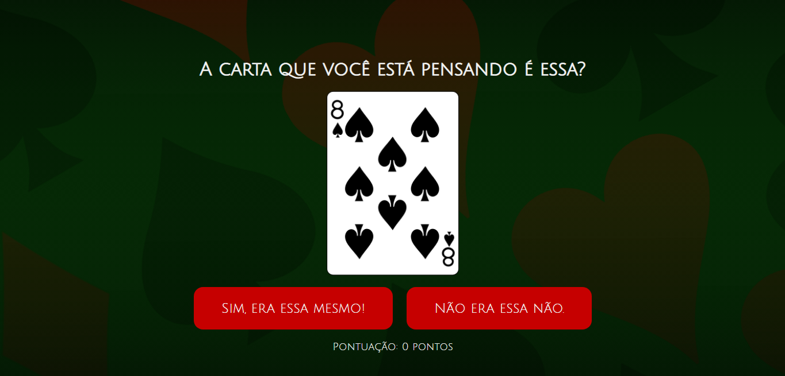
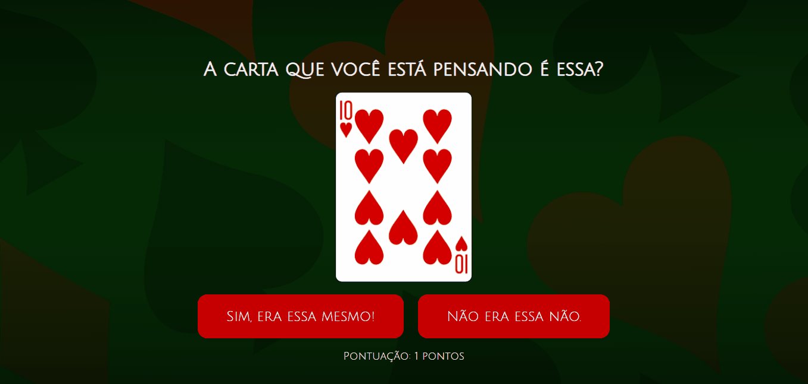
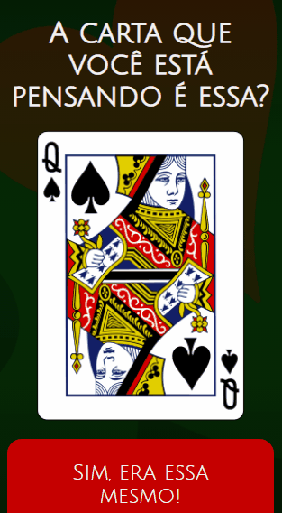

# Guessing Game 🃏

Projeto desenvolvido como material de estudos pessoais, com o objetivo de trabalhar mais React e o uso de Hooks.

## 🔧 Tecnologias

- React
- Styled-Components
- Javascript
- Axios
- Deck of Cards API

## 🔗 Acesso

Para acessar o app, <a href="https://guessing-game-chi.vercel.app/">clique aqui</a>!

## Demo

| Versão Desktop | Versão Mobile |
| -------------- | ------------- |
|  |  |